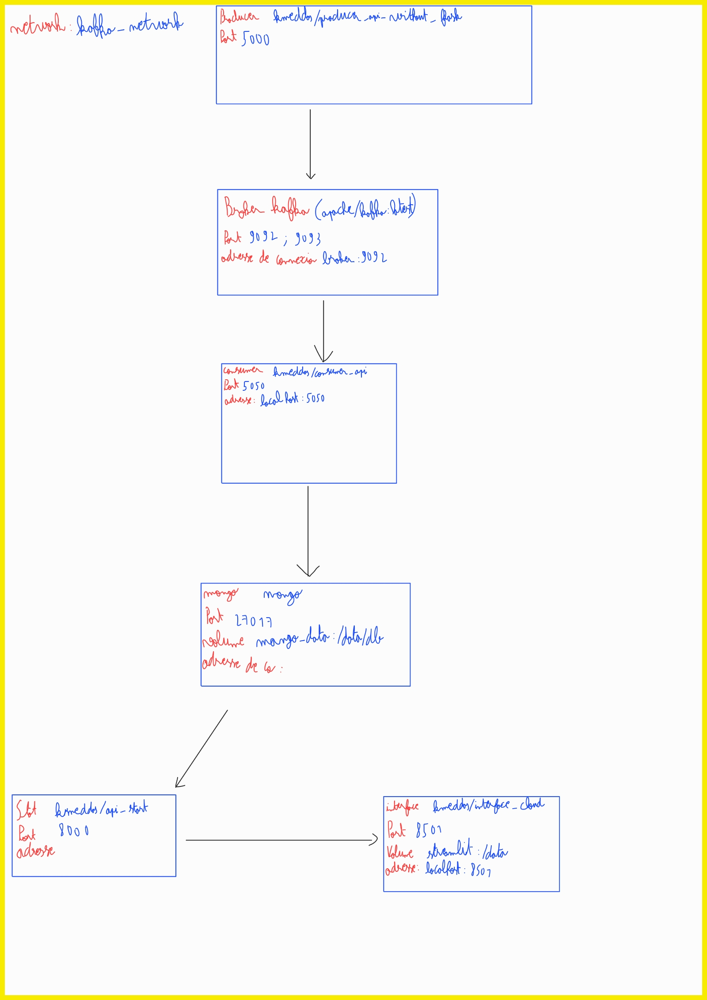

# Kafka and MongoDB Integration Using Python

This project showcases the integration of Kafka and MongoDB through a containerized environment. It involves Python-based producer and consumer services, Kafka for real-time message streaming, and MongoDB for database storage.

## Table of Contents
- [Introduction](#introduction)
- [System Architecture](#system-architecture)
- [File Organization](#file-organization)
- [Technologies Implemented](#technologies-implemented)
- [Setup Instructions](#setup-instructions)
- [Service Overview](#service-overview)
- [How to Use](#how-to-use)
- [Credits](#credits)
- [Additional Resources](#additional-resources)

---

## Introduction

This solution provides:
1. A Kafka producer to generate random transactions (tickets) and publish them to a Kafka topic.
2. A Kafka consumer to retrieve the messages and save them into MongoDB.
3. A visualization interface for Kafka topic monitoring through Kafdrop.
4. A browser-based dashboard for exploring MongoDB-stored data using Mongo-Express.

### New Feature: Batched Ticket Submission
1. Messages are grouped into batches of 10 tickets for streamlined processing.
2. Each ticket is associated with one of three store IDs.
3. Upcoming addition: A chart visualizing revenue distribution by store remains under development.

---

## System Architecture


---

## File Organization

```plaintext
.
├── build_python_mongo
│   ├── Dockerfile
│   ├── mangodb.py               # Python script for MongoDB integration
│   └── requirements.txt     # List of Python package dependencies
├── build_python_producer
│   ├── Dockerfile
│   ├── producer.py          # Script for Kafka message production
│   └── requirements.txt     # Python dependencies for the producer
├── stats
│   ├── Dockerfile
│   ├── api_stat.py          # Flask-based API for providing statistics
│   ├── connect.py           # Script to connect to MongoDB
│   ├── requirements.txt
│   ├── statistics.py        # Computes total revenue
│   ├── statistics2.py       # Computes average revenue
│   ├── statistics3.py       # Calculates revenue by product
│   ├── statistics4.py       # Tracks sales on a daily and monthly basis
│   └── statistics5.py       # Tracks revenue trends by day and month
├── interface
│   ├── Dockerfile
│   ├── app.py          # Frontend for interacting with system data
│   ├── pomme.jpg      # Background image for the interface
│   ├── requierement.txt
├── Architecture.jpg
├── docker-compose.yml       # Configuration file for Docker Compose
└── README.md
```

---

## Technologies Implemented
* **Docker**: To encapsulate each service in a dedicated container.
* **Kafka**: For real-time event streaming and data flow.
* **MongoDB**: To store and organize processed messages.
* **Python**: For creating Kafka producers, consumers, and APIs.
* **Streamlit**: For a dynamic and user-friendly interface.
* **Flask**: To build an API for statistics-related computations.

---

## Setup Instructions

### Prerequisites
Ensure the following tools are installed:
* Docker
* Docker Compose

### Steps to Deploy
1) Clone the project repository:
```bash
git clone https://github.com/MatheoROUVI/projet_kafka.git
cd projet_kafka
```

2) Build Docker images for producer and consumer (skip if images are prebuilt on Docker Hub):
```bash
docker build -t matheo444/producer.py ./build_python_producer
docker build -t matheo444/consumer.py ./build_python_mongo
```

3) Start all services using Docker Compose:
```bash
docker compose up
```
or
```bash
docker-compose up
```

4) Open the services in your browser:
* **Consumer API**: Navigate to [http://localhost:5050](http://localhost:5050)
* **User Interface**: Access it at [http://localhost:8501](http://localhost:8501)

---

## Additional Resources
* [Consumer API Docker Image](https://hub.docker.com/repository/docker/matheo444/consumer.py)
* [Producer API Docker Image](https://hub.docker.com/repository/docker/matheo444/producer.py)
* [Official Kafka Docker Image](https://hub.docker.com/r/apache/kafka)
* [MongoDB Docker Image](https://hub.docker.com/_/mongo)